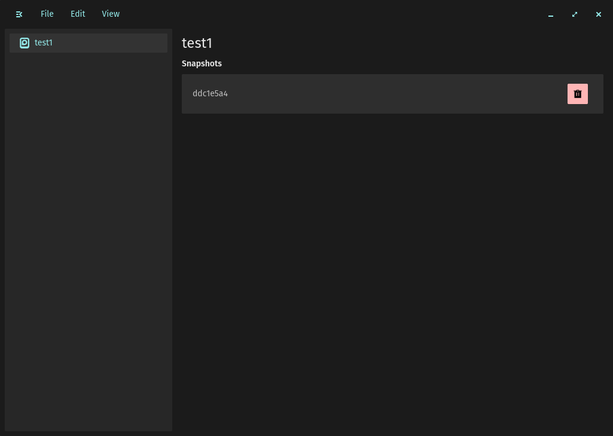

# Stellarshot

A backup application for the [COSMIC](https://system76.com/cosmic) desktop,
built on [rustic](https://rustic.cli.rs/).

Most people know they should back up and don't, because the tools ask too much.
The command-line tools are excellent and expect you to remember flags, write
cron jobs and read restore output. The friendly desktop tools let you keep
exactly one backup and make getting a single file back harder than it should be.

Stellarshot is heading towards a COSMIC-native backup app you set up once and
trust: several independent backups (your home folder to a USB drive, your
photos to Google Drive), each on its own schedule, and a restore process that
lets you browse any snapshot, see every version of a file, find what you
deleted, and preview a restore before anything is written.

Every backup is a standard **restic repository**. If this app disappeared
tomorrow, the `restic` and `rustic` command-line tools could still read every
snapshot you ever made.



> **Status: early, and not yet something to trust with your only copy.** The
> version here creates repositories, backs files up in the background with
> progress and Cancel, lists and deletes snapshots, and deletes repositories
> safely. Restore, folders, schedules and cloud storage are still to come. Keep another backup, and follow the
> [3-2-1 rule](https://www.backblaze.com/blog/the-3-2-1-backup-strategy/).

**[Roadmap](ROADMAP.md)** · **[Changelog](CHANGELOG.md)** ·
**[Security](SECURITY.md)** · **[Validation](VALIDATION.md)** ·
**[Contributing](CONTRIBUTING.md)**

---

## What it does today

- **Creates encrypted repositories.** Pick an empty folder, choose a password,
  and Stellarshot creates a restic-format repository there: AES-256
  encryption, content-defined deduplication, compression.
- **Refuses to create a repository on top of your files.** A folder that
  already holds other files is rejected, with an explanation. Earlier versions
  of Stellarshot would happily write a repository into your home directory.
- **Recognises an existing repository.** Choosing a folder that already holds
  one opens it with the password you give, and never initialises over it. A
  wrong password is an error, not a reason to start again.
- **Backs up files in the background.** Choose files and take a snapshot of
  them. The backup runs in its own process: the window stays responsive,
  shows how far it has got, and **Cancel** stops it. A cancelled or
  interrupted backup never leaves a half-written snapshot, and the repository
  stays sound (this is tested by killing a backup midway).
- **Only one backup writes to a repository at a time.** A second attempt is
  told the repository is busy instead of racing the first. If Stellarshot or
  the computer stops mid-backup, the lock goes with it; there is never a
  stale lock to clear.
- **Incremental.** Unchanged files are not stored again, and identical data
  is stored once however many files contain it.
- **Lists and deletes snapshots** in the selected repository.
- **Deletes a repository safely.** Only the entries the repository format
  creates (`config`, `keys`, `data`, `index`, `snapshots`, `locks`) are
  removed. Anything else in the same folder is left exactly where it was, and
  the folder itself is only removed if nothing else is in it.
- **Tells you when something fails.** Errors appear in a dialog, in your
  language where the cause is known, rather than disappearing into a log.
- **Carries your settings over** from the upstream Stellarshot, whose
  settings were stored under a different application ID.

## What is coming

In the order it will land (the detail is in [ROADMAP.md](ROADMAP.md)):

1. **Backup profiles and a new main screen**: "Back Up Now" on the front page,
   a setup wizard with include and exclude folders, a live estimate of how
   much will be backed up, and passwords remembered in your keyring.
2. **Storage locations**: USB drives recognised wherever they are mounted,
   SFTP servers, and Google Drive, OneDrive or any other rclone remote, with
   sign-in handled inside the app. Import from Déjà Dup.
3. **A complete restore**: browse snapshots, restore single files or folders,
   see every version of a file, find deleted files, compare two snapshots, and
   preview exactly what a restore will do.
4. **Automation**: scheduled backups, retention policies, notifications and
   periodic integrity checks.

---

## Requirements

- COSMIC desktop (Pop!\_OS 24.04 or newer, or any COSMIC session)
- The XDG desktop portal, which provides the file chooser (installed with
  COSMIC)
- A Rust toolchain (1.93 or newer) if building from source

`rclone` is recommended by the packages. Nothing uses it yet; cloud storage
will need it.

## Installing

### Packages

`.deb`, `.rpm` and a portable tarball are attached to each
[release](../../releases).

```sh
sudo apt install ./stellarshot_*.deb      # Debian, Ubuntu, Pop!_OS
sudo dnf install ./stellarshot-*.rpm      # Fedora
```

### From source

Clone this repository, then:

```sh
./install.sh
```

`install.sh` builds the release binary and installs it with the desktop entry,
icons and AppStream metadata under `/usr`. It is the single build path for local
installs, packages and CI:

| Command | What it does |
| --- | --- |
| `./install.sh` | Build and install system-wide |
| `./install.sh build` | Build only |
| `./install.sh uninstall` | Remove an installed copy (settings and repositories are kept) |
| `./install.sh deb` / `rpm` / `tarball` | Build one package into `dist/` |
| `./install.sh package` | Build all three |

Every build it makes passes `--features release-build`, so an installed or
packaged binary can never carry developer debug logging. Set `CARGO_JOBS=4` to
limit parallel compile jobs on a small machine.

---

## Using it

### Creating a repository

**File → New repository** (<kbd>Ctrl</kbd>+<kbd>R</kbd>) opens the file
chooser. Pick a folder for the repository, then set its password.

The folder must be **empty**, not exist yet, or **already hold a repository**.
A folder with anything else in it is refused. A repository is a set of files
and folders at the top of its folder (`config`, `keys`, `data`, ...). Mixing
those in with your own files is how a home directory ends up full of backup
internals, and it makes deleting the repository dangerous.

> **Remember the password.** The repository is encrypted with it. If it is
> lost, nobody can recover the backups, including you.

### Taking a snapshot

Select the repository in the sidebar and enter its password. Then **File →
Create snapshot** (<kbd>Ctrl</kbd>+<kbd>Shift</kbd>+<kbd>R</kbd>) opens the
file chooser, and the chosen files are backed up as one snapshot.

A progress card shows the current phase and how much has been stored. Press
**Cancel** to stop; nothing half-finished is kept. Closing the window does
*not* stop a backup that is already running: it finishes on its own.

For now the chooser selects files, not folders; see
[Known limitations](#known-limitations).

### Deleting

- **A snapshot:** the bin icon on its row.
- **A repository:** select it in the sidebar, then **Edit → Delete repository**
  (<kbd>Delete</kbd>). This removes the repository and every snapshot in it,
  and nothing else. Other files in the same folder are not touched.

### Keyboard shortcuts

| Shortcut | Action |
| --- | --- |
| <kbd>Ctrl</kbd>+<kbd>R</kbd> | New repository |
| <kbd>Ctrl</kbd>+<kbd>Shift</kbd>+<kbd>R</kbd> | Create snapshot |
| <kbd>Delete</kbd> | Delete the selected repository |
| <kbd>Ctrl</kbd>+<kbd>,</kbd> | Settings |
| <kbd>Ctrl</kbd>+<kbd>I</kbd> | About |
| <kbd>Ctrl</kbd>+<kbd>Shift</kbd>+<kbd>N</kbd> | New window |
| <kbd>Ctrl</kbd>+<kbd>W</kbd> | Close the window |

### Reading your backups without Stellarshot

Every repository is a standard restic repository:

```sh
rustic -r /path/to/repository snapshots
restic -r /path/to/repository snapshots
restic -r /path/to/repository restore latest --target ~/restored
```

---

## Settings

| Setting | Default | What it does |
| --- | --- | --- |
| Theme | Match desktop | Follow the desktop's light or dark mode, or force one |

Settings are stored through `cosmic-config` in
`~/.config/cosmic/io.github.stldave314.Stellarshot/`. Repository passwords are
never stored anywhere.

---

## Troubleshooting

**"… already contains other files" when creating a repository.**
Working as intended. Choose an empty folder, create a new one in the file
chooser, or choose a folder that already holds a repository.

**I used an earlier Stellarshot and it created a repository in my home folder.**
Earlier versions accepted any folder. If you picked your home folder, it
contains `config`, `keys`, `data`, `index` and `snapshots` entries that belong
to the repository. Check that they are the repository's before removing
anything: `config` is a small binary file, `data` holds 256 two-letter
folders, and `snapshots` lists one file per snapshot. Then either select
that repository in Stellarshot and use **Delete repository**, which removes
only those entries, or remove them yourself:

```sh
rm -r ~/config ~/keys ~/data ~/index ~/snapshots
```

**My repositories disappeared after updating.**
Settings are copied once from the upstream application ID
(`com.github.cosmic-utils.Stellarshot`) on first launch, and never over newer
settings. If you had already started this version before the copy could run,
copy them by hand:

```sh
cp -r ~/.config/cosmic/com.github.cosmic-utils.Stellarshot/v1 \
      ~/.config/cosmic/io.github.stldave314.Stellarshot/
```

**"Another backup is already using this repository."**
Only one process may write to a repository at a time. Wait for the other
backup to finish. If none is running, nothing is holding the lock either: it
is released automatically when a process ends, even when it crashes.

**"The password is incorrect."**
The password is the one set when the repository was created. There is no
way to recover or reset it.

**"The repository could not be created" with a rustic error underneath.**
The details line is the engine's own message. The most common causes are a
folder you do not have write access to, or a network mount that disappeared.

**Something else is wrong.**
Turn on developer logging: set `DEVELOPER_LOGGING` to `true` in
`src/debug.rs`, rebuild *without* `--features release-build`, reproduce the
problem, and read `/tmp/stellarshot-debug.log`. Lines are tagged by category
(`ENGINE`, `UI`, `CONFIG`) so you can `grep` a run. Genuine errors are always
written to stderr too.

---

## Known limitations

- **The password is asked for every time** you select a repository. Keyring
  storage arrives with backup profiles.
- **The snapshot chooser picks files, not folders.** Folder selection, include
  and exclude lists arrive with backup profiles.
- **There is no restore in the app yet.** Use `restic restore` or
  `rustic restore` (see
  [Reading your backups](#reading-your-backups-without-stellarshot)).
- **Local folders only.** USB drives by UUID, SFTP and cloud storage come later.
- **Some translations are machine-assisted.** Strings added in this version
  were translated without review by native speakers. `tests/i18n.rs` proves
  every locale has the same keys and placeholders as English, but not that the
  wording is right. Corrections are welcome.

---

## How it works

```
  ┌────────────────────────────────────┐        job on stdin (JSON,
  │  window  (libcosmic)               │        including the password)
  │  sidebar, snapshot list, dialogs,  │ ───────────────────────────┐
  │  progress card                     │                            │
  └──────┬─────────────────────────────┘                            ▼
         │ reads on blocking threads          ┌──────────────────────────────┐
         │ (list snapshots, open, create)     │  stellarshot --run backup    │
         │                                    │  one write, in its own       │
         │ ◀──── progress and outcome ─────── │  process; holds the lock     │
         │       as JSON lines on stdout      └──────────────┬───────────────┘
         ▼                                                   ▼
  ┌──────────────────────────────────────────────────────────────────────────┐
  │  engine: the only code that talks to rustic                              │
  │  open · init · probe · snapshots · backup · restore · check · lock       │
  └──────────────────────────────────┬───────────────────────────────────────┘
                                     ▼
                    rustic_core → restic-format repository
```

Writes (backup, restore, check, deleting snapshots) run in a child process,
`stellarshot --run <operation>`, because rustic cannot be interrupted once an
operation starts and a process can. The password reaches the child on stdin,
never in its command line or environment, both of which other programs
running as you can read.

| Module | Responsibility |
| --- | --- |
| `engine` | Everything that touches rustic: opening and creating repositories, backup, restore, integrity checks, snapshot listing and deletion. Synchronous, plain types, typed errors |
| `engine::location` | Whether a folder may hold a repository; deleting only a repository's own entries |
| `engine::lock` | One writer per repository, shared by every process; released by the kernel if the holder dies |
| `engine::progress` | Turns rustic's per-blob progress calls into a few reports a second |
| `runner` | `stellarshot --run`: reads a job from stdin, runs it under the lock, reports JSON lines |
| `app` | The window: sidebar, dialogs, menus, settings |
| `app::child` | Spawns `--run`, streams its events into the UI, cancels it |
| `app::views::content` | The snapshot list and the progress card |
| `app::errors` | A localized explanation for every kind of engine error |
| `app::migrate` | One-time copy of settings from the upstream application ID |
| `constants` | Implementation tuning values |
| `debug` | Developer logging to a file, compiled out of release builds |

---

## Building

```sh
cargo build --release --features release-build
cargo test
cargo clippy --all-targets --all-features
```

Both `cargo check` and `cargo clippy` are warning-free, and CI enforces it with
`RUSTFLAGS=-D warnings`. What each check proves, and how each one is kept from
passing when it has nothing to check, is in [VALIDATION.md](VALIDATION.md).

## Translations

English, Bulgarian, German, Swedish and Swiss German. Each locale lives in
`i18n/<locale>/stellarshot.ftl`, and `tests/i18n.rs` fails the build if any
locale has a missing, extra or duplicated key, or a changed `{ $placeholder }`.
See [CONTRIBUTING.md](CONTRIBUTING.md#translations).

## Contributing

See [CONTRIBUTING.md](CONTRIBUTING.md) and the
[Code of Conduct](CODE_OF_CONDUCT.md). Security problems go through
[SECURITY.md](SECURITY.md), not the public issue tracker.

## Credits

Stellarshot was created by **Aaron Honeycutt** and **Eduardo Flores** in the
[cosmic-utils](https://github.com/cosmic-utils) organisation, with translations
from its contributors. This project continues from their work.

Backups are made by [rustic](https://rustic.cli.rs/), a Rust implementation of
the [restic](https://restic.net/) repository format.

## Licence

GPL-3.0-only. See [LICENSE](LICENSE).
